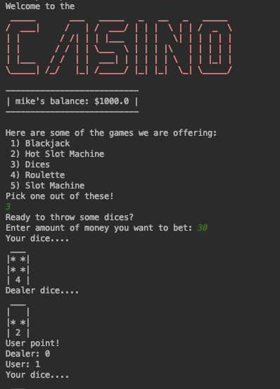

# Grade-11-Final-Project
This is a text-based casino site simulation using email, text files, and other python concepts. 

## Game features:
1. Registering: signing up, entering information, after this part anytime you run the program the progress will be saved.
2. Logging in: You recieve $1000 to start and may bet on any of the following games:
      1. BlackJack
      2. Flaming Hot Slot 
      3. Roulette
      4. Dices
      5. Slot Machine
 
3. Leaderboard: The program will store the top players into a leaderboard

4. Email notifications: The program will send email notifications regarding your progress, sign up notifications, and losing.

5. Losing: If you run out of money, the program will automtically kick you out, and your account will be deleted.

## Using the code 

To use the code, save the `casion.py` to a python editor such as Pycharm along with the `Casino.png` image. 

## Game flow:
Flow Chart:

## Game Example

## Contributors
- Jake Graef (project teamate) 
